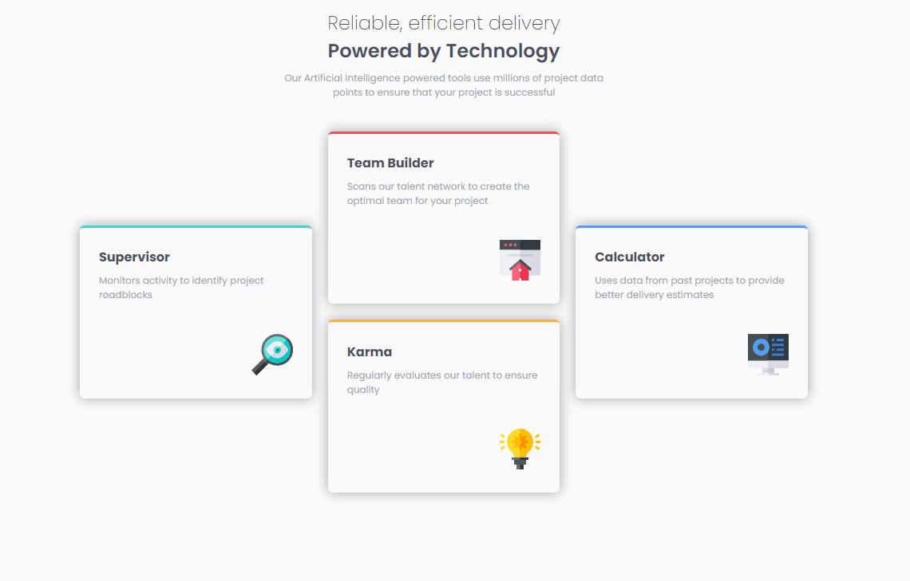

# Frontend Mentor - Four card feature section solution

This is a solution to the [Four card feature section challenge on Frontend Mentor](https://www.frontendmentor.io/challenges/four-card-feature-section-weK1eFYK). Frontend Mentor challenges help you improve your coding skills by building realistic projects. 

## Overview
### Screenshot

### Links

- Solution URL: https://www.frontendmentor.io/solutions/fourcardfeature-SymuwfRUc
- Live Site URL: https://wallaceanterio.github.io/four-card-feature-section-master/

### Built with

- Semantic HTML5 markup
- CSS custom properties
- Flexbox
- CSS Grid
## Author

- Linkedin - https://www.linkedin.com/in/wallaceanterio/
- Frontend Mentor - [@wallaceAnterio] https://www.frontendmentor.io/profile/wallaceAnterio
